# DO Genie Assistant

### Funcionalidades
  #### Adicionar OPS e XP na tela de detalhes do jogador
  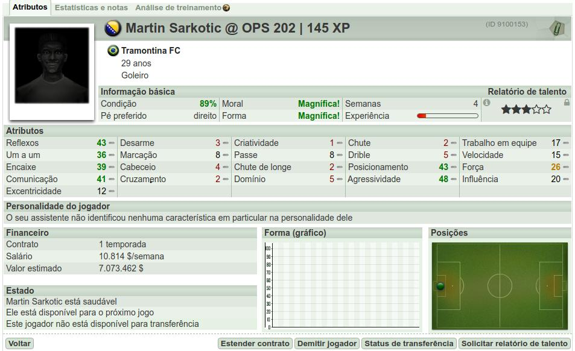

  #### Adicionar o nome do jogador como titulo da pagina na pagina de detalhes do jogador
  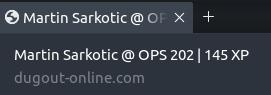

  #### Mudar o titulo da pagina em todas as paginas
  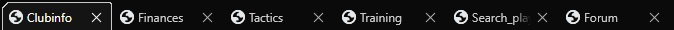

  #### Adicionar OPS na tela de elenco
  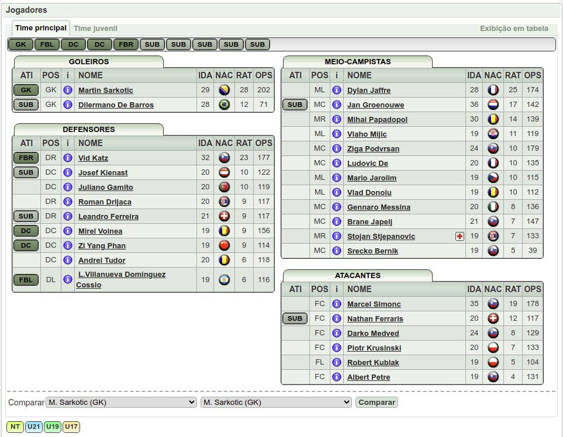

  #### Adicionar ordenar tabela de jogadores
  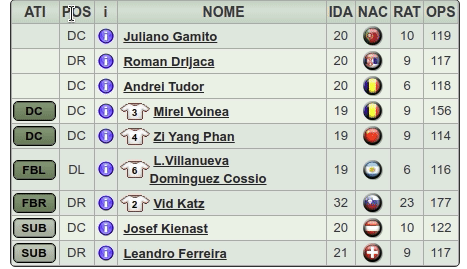

  #### Titulares em negrito para diferenciar dos reservas
  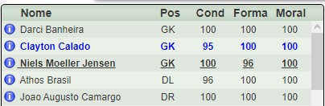
  
  #### Carregar taticas
  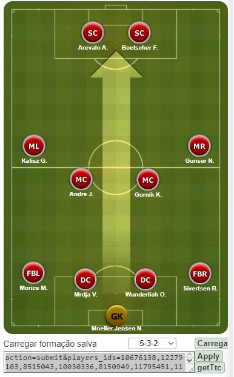
  
  #### Adicionar OPS na tela de taticas
  

  #### Adicionar relógio secundário com o horário real
  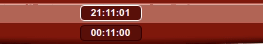

  #### Menu Dropdown 
  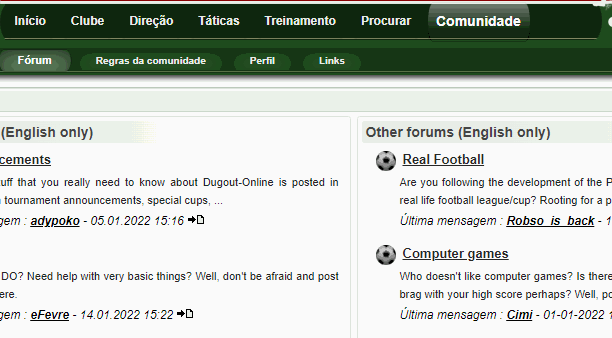
  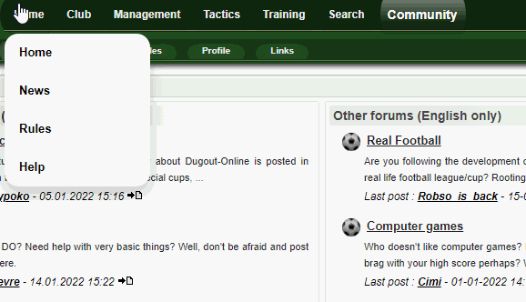

  #### Botões de oferta +100k e +50% ou +1M
  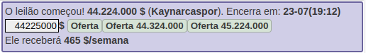

  #### Estimativa do salário do treinador na busca
  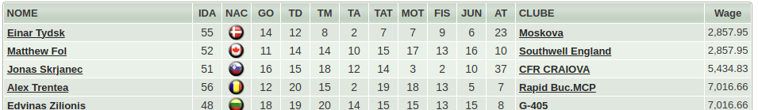

  #### Botão de relatório espião no proprio time
  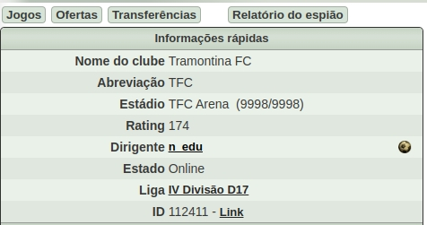

### To-Do list
- [ ] - 

### Como instalar 
1. Instalar o [Tampermonkey](https://www.tampermonkey.net/)
2. Adicionar o DO Genie Assistant ao Tampermonkey [clicando aqui](https://github.com/edunogueira/DOGenieAssistant/raw/main/DOGenieAssistant.user.js)

#### Duvidas ou sugestões, estou no grupo do telegram <https://www.dugout-online.com/forum/viewtopic/t/472110> 
#### Faça parte da nossa comunidade!

###### Meu time: [Tramontina FC](https://www.dugout-online.com/clubinfo/none/clubid/112411)
